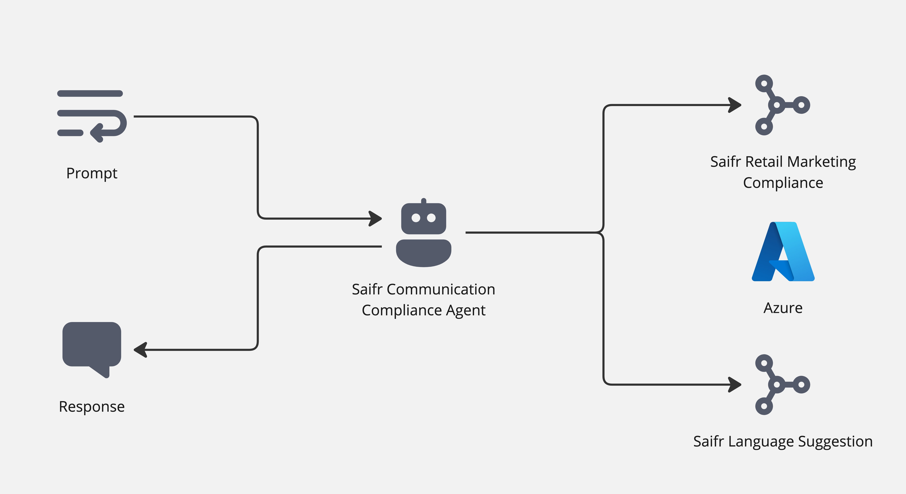

# Saifr Communication Compliance Agent

## Description 

The Saifr Communication Compliance Agent converts potentially noncompliant text to a more compliant, fair, and balanced 
version, helping end users better adhere to relevant regulatory guidelines.

_Saifr Agent is not intended to replace the end user’s legal, compliance, business, or other functions, 
or to satisfy any legal or regulatory obligations.  Note that all compliance responsibilities remain solely 
those of the end user and that certain communications may require review and approval by properly licensed 
individuals.  Saifr is not responsible for determining compliance with rules and will not be liable for 
actions taken or not taken based on Agent use._

### Architecture Overview
The Saifr Communication Compliance Agent uses gpt-40-mini (version:2024-07-18) as the agent orchestrator LLM. We chose 
this as it is a fast small model that is function calling aware. This agent leverages **Azure AI Agent Service**, using the following tools,  "AI Tools", in this case 
each tool is in fact a Saifr model that has been deployed from the Azure AI Foundry Model catalog (see below). The tools are configured using OpenAPI 3.0 specification. 

- [Saifr-Retail-Marketing-Compliance](https://ai.azure.com/explore/models/Saifr-Retail-Marketing-Compiance/version/1/registry/azureml-saifr)
- [Saifr-Language-Suggestion](https://ai.azure.com/explore/models/Saifr-Language-Suggestion/version/1/registry/azureml-saifr)

Given the following prompt:-
> Given the following paragraph check it for compliance having a risk level of Low. For any sentences 
that are non compliant please obtain a suggested compliant sentence and rebuild the paragraph

The agent will check our first model to determine the non compliant sentences, any that are non compliant will then be checked 
against the second model to obtain a compliant sentence and then the agent will reconstruct the paragraph.

### Use Cases
- Compliance Checks: Saifr's Compliance Communication Agent eases content creation for marketing teams by scanning content for compliance with regulatory rules, such as FINRA 2210, flagging potentially non-compliant phrases and suggesting more compliant language.
- Efficiency Improvement: With AI generating more compliant content, Saifr's Compliance Communication Agent helps compliance teams work more efficiently by reducing review times.

### Agent Setup

1. Deploy Saifr-Retail-Marketing-Compliance and Saifr-Language-Suggestion  from Azure AI Foundry Model catalog. In this sample agent we are using anonymous authentication. 
2. Modify the [isParagraphCompliant.json](python/isParagraphCompliant.json) to indicate the endpoint of the Saifr Retail Marketing Compliance model. 
3. Modify the [SuggestedCompliantSentence.json](python/SuggestedCompliantSentence.json) to indicate the endpoint of the Saifr Retail Marketing Compliance model.
4. Execute template.py which will create the agent, execute a test and delete the agent.

### Example Agent Intractions

The following are some prompts that have been tried with the Saifr Communication Compliance Agent

#### Example Request:
>I guarantee you will lose money! We are confident that we can beat the S&P 500 index over time. Invest in bitcoin to get rich fast.

#### Example Response:
>Investing in our company has the potential to increase your wealth. Our strategies are designed with the aim to potentially 
> outperform the S& P 500 index over time. Bitcoin is a potential investment option that may offer returns, 
> but like all investments, it carries risk.

#### Example Request:
> This is a perfectly good sentence. Invest in bitcoin to get rich fast!

#### Example Response:
>The sentence "Invest in Bitcoin to get rich fast is non-compliant due to its misleading nature. A suggested compliant sentence 
> could be: "Consider Bitcoin as one of many investment options, but we aware that all investments carry risks."
> 
> Here is a revised version of your sentence:
> This is a perfectly good sentence. Consider Bitcoin as one of many investment options, but we aware that all investments carry risks.

Saifr redefines how compliance operates with advanced AI technology, the right data, and deep industry expertise. Built within Fidelity Investments’ innovation incubator, Fidelity Labs, Saifr harnesses the power of AI agents to help address the limitations and inefficiencies within traditional compliance frameworks, helping safeguard organizations from regulatory and reputational risks. Saifr helps clients save time, reduce costs, and improve accuracy while protecting their firms. Our AI-powered risk prevention and
management solutions include capabilities for marketing compliance review, adverse media monitoring, and electronic communications surveillance.

Support: getsupport@saifr.ai

