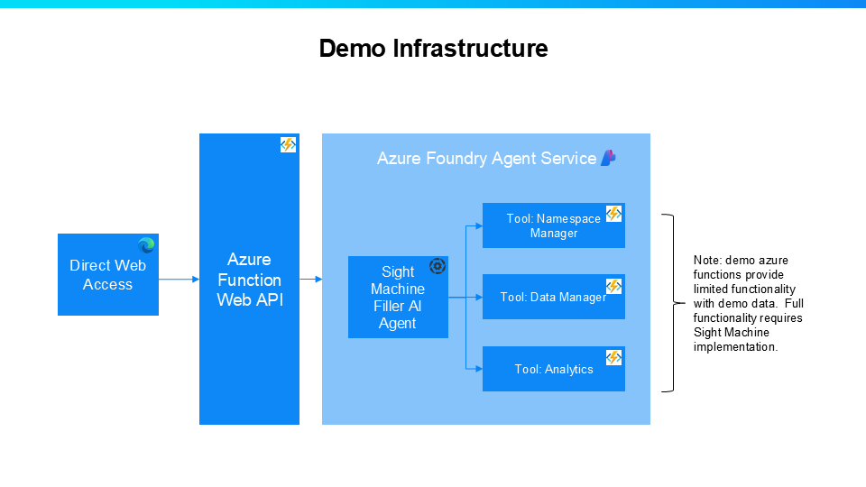
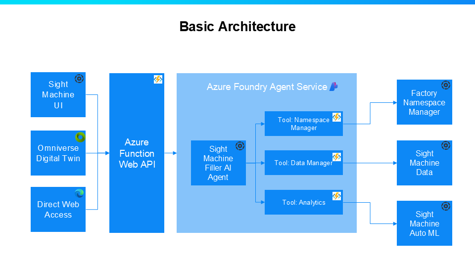

<h1>
<span style="display: flex; align-items: center;">
  <picture>
    <source media="(prefers-color-scheme: dark)" srcset="./assets/SM_Aperture_42x42_fff.svg">
    <source media="(prefers-color-scheme: light)" srcset="./assets/SM_Aperture_500x500_333.svg">
    
  </picture>
  <span style="margin-left: 10px;">Sight Machine Filler Agent</span>
</span>
</h1>

This repository provides templates for deploying and running the Sight Machine Filler Agent.  Sight Machine is a data and analytics platform for manufacturing.  We model data, provide basic visualization and analytics tools, and provide advanced AI analytics for manufacturing plant floor users.  For more information, see www.sightmachine.com.

**WARNING**: Full functionality of this agent, including advanced features, requires a subscription to Sight Machine. However, basic example data allows users to test and explore the core functionality of the agent.

**IMPORTANT NOTE FROM MICROSOFT:**  The sample below was created by a third party, not Microsoft, and has not been tested or verified by Microsoft. Your use is subject to the terms provided by the relevant third party.  By using the third-party sample in this file, you are acknowledging that Microsoft has no responsibility to you or others with respect to this sample.  

## Use Cases

This is a tool to help manufacturers with Filling machines optimize their process.  It is designed to help with data retrieval, reporting, root cause analysis, predictions, and anomaly detection.

Potential use cases include retrieving key performance indicators and other metrics, identifying root causes of downtime or throughput issues, and detecting anomalies in key process variables.

## Architecture Overview

The following diagram illustrates the architecture used in demo environments.



The following diagram illustrates the architecture when using a full implementation paired with Sight Machine:




## Project Structure
- `README.md` - This file, project documentation and install instructions
- `LICENSE` - Project license
- `infra` - Folder with Bicep files for deployment
- `python` - Example Python scripts for running the agent
- `assets` - Image files for documentation

## Prerequisites

1. **Azure Subscription**: Ensure you have an active Azure subscription
2. **Azure Resource Group**: Strongly recommend having a dedicated resource group for the required supporting Azure resource
3.  **Azure Developer CLI (azd)**: Install [azd](https://learn.microsoft.com/en-us/azure/developer/azure-developer-cli/install-azd)
4.  **Python**: Install Python 3.10 or later.
5.  **VS Code**: Strongly recommend [VS Code](https://code.visualstudio.com/download) with the [Azure Functions extension](https://learn.microsoft.com/en-us/azure/azure-functions/functions-develop-vs-code).  

## Deployment

Once you have a subscription and resource group, initialize the project by running the following command: 

**TODO: Once this is in a github repo, revise this to a azd init --template command**

```bash
azd init --from-code
```

If prompted, provide a project name such as `filler_agent` and select to keep existing files unchanged.

Next, provision the resources in Azure
```bash
azd provision
```

Finally, create the `local.settings.json` in the `python` folder.
```json
{
  "IsEncrypted": false,
  "Values": {
    "FUNCTIONS_WORKER_RUNTIME": "python",
    "STORAGE_CONNECTION__queueServiceUri": "https://<storageaccount>.queue.core.windows.net",
    "PROJECT_CONNECTION_STRING": "<project connection for AI Project>",
    "AzureWebJobsStorage": "UseDevelopmentStorage=true"
    }
}
```

## Test app in VS Code
1.  Open VS Code, and then open the `python` folder for this app. VS Code should detect that this is an Azure Function app and prompt you to set up the environment for debugging.
2. Launch Azurite by selecting `Azurite: Start` from the command palette (F1).
3.  Run the debugger.  If prompted with any warnings, select `Debug Anyway`
4.  Once started, open a web browser and go to `localhost:7071/api/main`.  

## Example questions
1.  What is the current throughput on Filler 1?
2.  What would my throughput be on Filler 1 if Pressure was 5% higher.
3.  Did you detect any recent anomalies on Filler 1?

## Support

- Technical support: email `support@sightmachine.com`
- Setting up an account: Fill out our [contact form](https://sightmachine.com/contact/)
