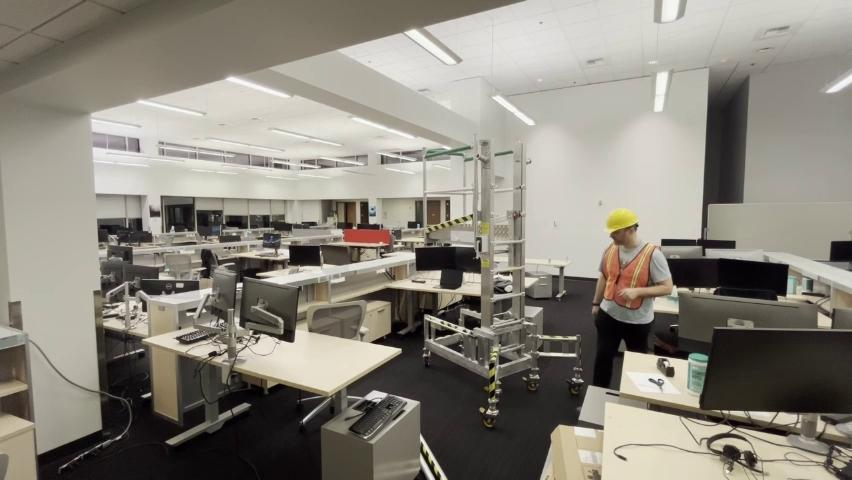
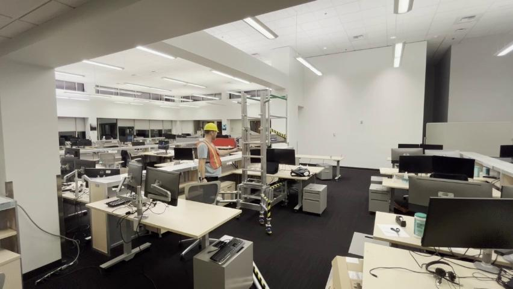
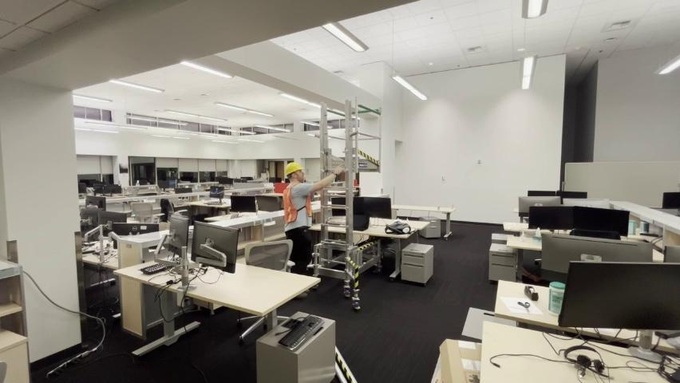
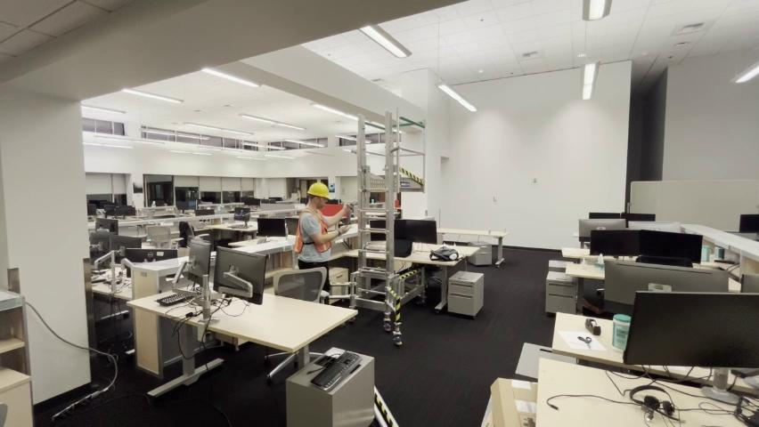
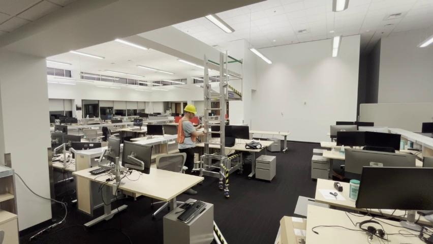
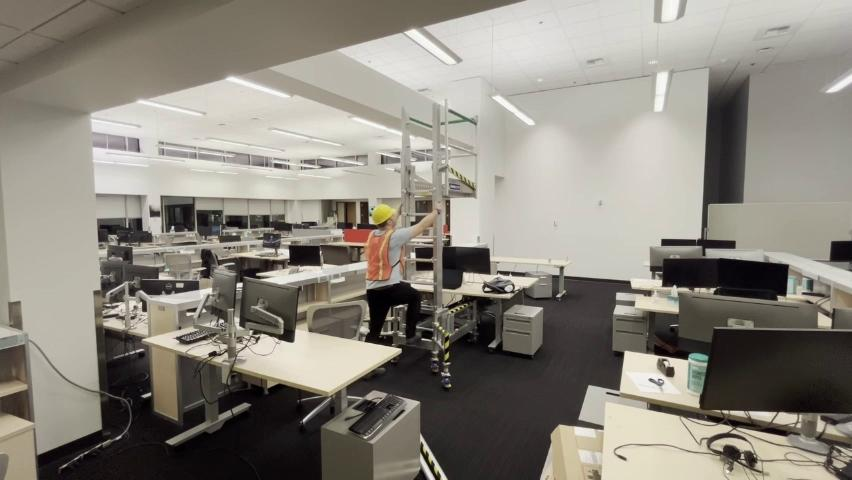
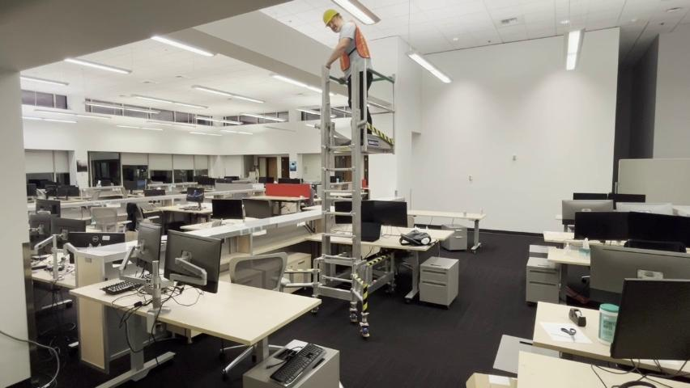
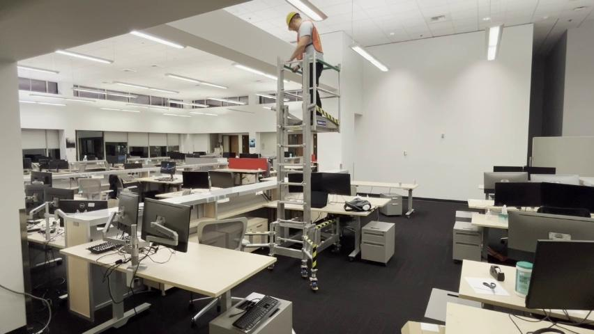

# Hover Lift Operation – Standard Operating Procedure
**Purpose:** Safely and effectively use a hover lift for maintenance tasks without disturbing the surrounding work environment.  
**Equipment:** Hover lift, crank mechanism, safety locking mechanisms, and ladder.  
**Prerequisites:** Ensure the hover lift is fully assembled, confirm the legs and wheels are locked, and have an unobstructed workspace.

## Step 1 – Prepare Hover Lift for Use

Ensure the hover lift is assembled and the legs are securely locked. Verify the lift's readiness for maneuvers over the work area without disturbing any fixtures or contents.

**Call‑outs**  
* 🔹 *Tip:* Ensure legs are locked before moving the lift.  
* ⚠️ *Caution:* Check for proper assembly before operating the lift.

## Step 2 – Position Hover Lift

Move the hover lift into place carefully over the work area, ensuring stability. Lock the wheels using the tabs to secure its position.

**Call‑outs**  
* 🔹 *Tip:* Position the lift directly above the workspace, avoiding other furniture.  
* ⚠️ *Caution:* Lock all wheels before proceeding with operations to prevent movement.

## Step 3 – Adjust Height

Turn the crank clockwise to raise the hover lift to the desired height. Ensure the wheels remain locked during this adjustment.

**Call‑outs**  
* 🔹 *Tip:* Turn the crank slowly to maintain stability.  
* ⚠️ *Caution:* Wheels must be locked before adjusting height to avoid accidents.

## Step 4 – Confirm Basket Lock

Ensure the lift's basket lock is engaged before raising or operating the lift. This step prevents basket movement during operation.

**Call‑outs**  
* 🔹 *Tip:* Double-check basket locks before adjustments.  
* ⚠️ *Caution:* The basket must be locked to ensure the operator's safety.

## Step 5 – Perform Safety Check

Perform a thorough safety check, ensuring the basket lock, wheel locking mechanisms, and ladder slots are secure before ascending.

**Call‑outs**  
* 🔹 *Tip:* Check all locks systematically for secure operation.  
* ⚠️ *Caution:* Avoid ascending if any safety mechanism is improperly engaged.

## Step 6 – Ascend Lift

Ascend the ladder to start your task. Make sure the lift height is appropriate for the work and clear the workspace of any obstructions beforehand.

**Call‑outs**  
* 🔹 *Tip:* Maintain proper posture while climbing.  
* ⚠️ *Caution:* Only ascend after confirming all locks are secure.

## Step 7 – Secure Ladder and Basket

Lock the ladder and cage mechanisms to provide stability while working at height. Check all locks periodically during use.

**Call‑outs**  
* 🔹 *Tip:* Verify cage locks for added security before continuing work.  
* ⚠️ *Caution:* Do not proceed if any lock or mechanism fails to function properly.

## Step 8 – Begin Task Over Work Area

Begin your task above the desk area, ensuring careful adjustments of position and tools without disturbing the workspace below.

**Call‑outs**  
* 🔹 *Tip:* Maintain balance and work carefully to prevent any accidents.  
* ⚠️ *Caution:* Use safety gear like helmets when working at height.

## Step 9 – Lock Cages for Stability

Secure the ladder’s cages to provide additional stability as you begin working on overhead fixtures, such as lights, safely.

**Call‑outs**  
* 🔹 *Tip:* Confirm ladder’s overall stability before handling tools.  
* ⚠️ *Caution:* All locking mechanisms must be engaged before overhead work.

## Step 10 – Complete Task and Descend

Reverse your ascent steps after completing the maintenance task. Carefully descend the ladder and bring the hover lift back to its starting position.

**Call‑outs**  
* 🔹 *Tip:* Check your path down for a clear and safe descent.  
* ⚠️ *Caution:* Ensure no obstructions or tools remain in the path before descending.

## Troubleshooting / FAQ
1. **What if the crank mechanism doesn’t lift the basket?**  
   - Confirm the crank is properly engaged and the wheels are locked. Inspect for obstructions.

2. **How do I address unstable movement during ascent?**  
   - Verify all basket and wheel locks are securely engaged before continuing.

3. **What should I do if the cage locks fail?**  
   - Immediately cease operations and inspect the locking mechanisms for damage or improper assembly.

This SOP ensures safe and effective use of the hover lift for overhead maintenance tasks, prioritizing operator and workspace safety at all stages of operation.