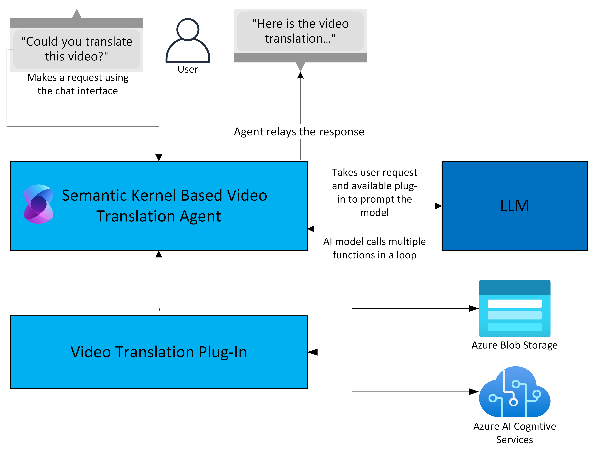

# Video Translation Agent

## Summary

The Video Translation Agent is an AI-powered agent that enables users to translate videos between languages with customizable speech and subtitle options. It leverages Azure AI Foundry, Azure AI Cognitive Services, and Azure Blob Storage to provide high-quality video translations.

## Demo

<div align="center">
  <video width="800" controls>
    <source src="./assets/demo.mp4" type="video/mp4">
    Your browser does not support the video tag.
  </video>
</div>

You can find the demo video at `./assets/demo.mp4` in the repository.

## Use Cases

1. **Corporate Communications** 🏢 - Translate training videos, executive messages, and internal communications to reach global employees in their native languages.

2. **Educational Content** 🎓 - Enable educators to translate course materials and lectures for international students, expanding the reach of educational content.

3. **Marketing and Sales** 📊 - Localize marketing videos and sales presentations for different regions and markets, increasing engagement with international audiences.

## Architecture Overview

The Video Translation Agent uses:
- **Azure AI Agents** - For conversation management and orchestration
- **Semantic Kernel** - For creating the AI Agent and managing plugins
- **Azure AI's Cognitive Services Video Translation API** - For the core video translation functionality
- **Azure Blob Storage** - For secure file storage and retrieval

<div align="center">
  
</div>

## Setup Instructions

### Prerequisites

- [Python > 3.11.10](https://www.python.org/downloads/)
- [Git](https://git-scm.com/downloads)
- Azure resources:
  - **Azure subscription**: [Create a free account](https://azure.microsoft.com/free/) if you don't already have one
  - **Azure AI Speech Services**: 
    - Create a [Speech resource](https://portal.azure.com/#create/Microsoft.CognitiveServicesSpeechServices) in a [supported region for video translation](https://learn.microsoft.com/azure/ai-services/speech-service/regions#speech-service)
  - **Azure Blob Storage**:
    - [Create a storage account](https://learn.microsoft.com/azure/storage/common/storage-account-create) with a container configured for video uploads
    - To provide video access either
      - Generate a [SAS token](https://learn.microsoft.com/azure/storage/common/storage-sas-overview) to provide as a video URL directly to the agent
      - Tell the agent where your video is located locally (via file path) and the agent will handle uploading the video to the storage account and generating the url
  - **Azure CLI**: [Install](https://learn.microsoft.com/cli/azure/install-azure-cli) and authenticate using `az login`

### Setting up Azure AI Agent Service

Follow the [official Azure AI Agent Service documentation](https://learn.microsoft.com/azure/ai-services/agents/quickstart?pivots=ai-foundry-portal) quickstart. This guides you through creating a hub and project in the Azure AI Foundry Portal and deploying your model. Once completed, you'll have the necessary credentials to configure your environment variables in the next steps.

### Quickstart

1. Clone the repository and navigate to the `video-translation-agent` folder using the "cd" command in the terminal.

2. Create and activate a virtual environment:

```bash
python -m venv .venv
source .venv/bin/activate  # On Windows, use: .venv\Scripts\activate
```

3. Install the required dependencies:

```bash
pip install -r requirements.txt
```

4. Create a `.env` file based on the `.env.sample` provided:

```bash
cp .env.sample .env
```

5. Update the `.env` file.

### Running the Video Translation Agent

Start the agent with:

```bash
python template.py
```

The agent will guide you through the process of translating videos, providing helpful prompts for required information. To exit the agent at any time, simply type `exit` or `quit` in the console.

## Sample Data

### Video Requirements

- .mp4 format video file
- Less than 5 GB in size
- Shorter than 4 hours in duration
- Verify your [source and target languages are supported](https://learn.microsoft.com/azure/ai-services/speech-service/language-support?tabs=video-translation)

### Sample Files for Testing

You can provide the agent with this video URL directly [es-ES-TryOutOriginal.mp4](https://speechstudioprodpublicsa.blob.core.windows.net/ttsvoice/VideoTranslation/PublicDoc/SampleData/es-ES-TryOutOriginal.mp4). 

The repository also includes sample files in the `sample_data/` directory to help you test the agent:

- **Sample Video in English**: `sample_data\en-US-TryoutOriginalTTSIntro.mp4`
- **Sample Video in Spanish**: `sample_data\es-ES-TryOutOriginalElSalvadorMicrosoftIntro.mp4`

## Example Agent Interaction

### Video Translation

Translate videos from one language to another with the following options:
- Source and target languages
- Voice type (Platform Voice or Personal Voice)
- Speaker count customization
- Subtitle character limit adjustment
- Embedded subtitle options

### File Management

The agent can work with:
- Local video files (automatically uploads to Azure Blob Storage)
- Remote video URLs (direct processing)
- WebVTT subtitle files for custom iterations

### Translation Management

Manage your translations with commands to:
- List all translations
- Get details about specific translations
- Create new iterations with customized subtitles
- Delete translations

### Translating a Video

```
You: I'd like to translate a video from English to Japanese
Agent: I can help you translate your video from English to Japanese. First, I need to know if you have a local video file on your computer or a URL to a video stored online.

You: I have a local file at C:\Videos\my_presentation.mp4
Agent: Great! I'll need to upload that file to Azure Blob Storage first so it can be processed.
[Agent uploads file]
Video uploaded successfully!
Access URL: https://yourstorageaccount.blob.core.windows.net/videos/my_presentation.mp4
Secure access URL (valid for 24 hours): https://yourstorageaccount.blob.core.windows.net/videos/my_presentation.mp4?sv=...

Now I need a few more details:
1. Would you like to use "PlatformVoice" or "PersonalVoice" for the translation? PlatformVoice is the standard option.
[...]
```


```
You: I need to translate our new training video from English to Spanish, French, and German for our international facilities. The video is hosted on our secure server.

Agent: I'd be happy to help translate your training video. Do you have a URL for the video, or is it stored locally on your computer?

You: It's available at https://yourstorageaccount.blob.core.windows.net/videos/my_training_video.mp4

Agent: Perfect. I'll use this URL directly for the translation process. Now I need some details for the translation:
1. Would you like to enable subtitles for accessibility?
2. How many speakers are in your video? This helps with speaker identification.

You: Yes, please enable subtitles. We have 2 speakers - a narrator and a demonstrator.

Agent: I'll set up the translations with subtitles and optimize for 2 speakers.

Starting translation process for all three languages:
- English → Spanish (es-ES): Processing...
- English → French (fr-FR): Processing...
- English → German (de-DE): Processing...
```

### Creating an Iteration with Custom Subtitles

```
You: I want to improve the subtitles for my translation
Agent: I can help you create a new iteration with custom subtitles. Do you have the Translation ID for the video?

You: Yes, it's 06202024123045_en-US_ja-JP_PlatformVoice
Agent: Great! Now I need the URL to your WebVTT subtitle file and the type of WebVTT file you're providing.
[...]
```

### Listing previous translations

```
You: Could you please provide me with my five most recent translations?
Agent: I'll retrieve your 5 most recent translations:

1. Translation ID: 07152023153045_en-US_ja-JP_PlatformVoice
   - Source Language: English (en-US)
   - Target Language: Japanese (ja-JP)
   - Created: July 15, 2025 15:30:45
   - Status: Completed
   - Video URL: https://yourstorageaccount.blob.core.windows.net/videos/quarterly_review.mp4

2. Translation ID: 07102023091230_en-US_fr-FR_PlatformVoice
   - Source Language: English (en-US)
   - Target Language: French (fr-FR)
   - Created: July 10, 2025 09:12:30
   - Status: Completed
   - Video URL: https://yourstorageaccount.blob.core.windows.net/videos/product_launch.mp4

3. Translation ID: 07052023142215_en-US_es-ES_PlatformVoice
   - Source Language: English (en-US)
   - Target Language: Spanish (es-ES)
   - Created: July 5, 2025 14:22:15
   - Status: Completed
   - Video URL: https://yourstorageaccount.blob.core.windows.net/videos/training_module_3.mp4

4. Translation ID: 06302023103345_en-US_de-DE_PlatformVoice
   - Source Language: English (en-US)
   - Target Language: German (de-DE)
   - Created: June 30, 2025 10:33:45
   - Status: Completed
   - Video URL: https://yourstorageaccount.blob.core.windows.net/videos/executive_message.mp4

5. Translation ID: 06252023081120_en-US_it-IT_PlatformVoice
   - Source Language: English (en-US)
   - Target Language: Italian (it-IT)
   - Created: June 25, 2025 08:11:20
   - Status: Completed
   - Video URL: https://yourstorageaccount.blob.core.windows.net/videos/customer_testimonial.mp4

Would you like to get more details about any specific translation or perform any actions with these translations?
```

## ⚠️ Troubleshooting

Common issues and solutions:

- **Authentication Errors**: Ensure you're logged in with `az login` and have the proper permissions.
- **File Upload Issues**: Check your storage account name and permissions.
- **Translation Failures**: Verify your video format is supported and your Cognitive Services endpoint is correct.

### Logging Configuration

By default, logging is set to the ERROR level. If you need more detailed output for debugging or monitoring, you can adjust the logging level:

```bash
# Options include: DEBUG, INFO, WARNING, ERROR, CRITICAL
export LOG_LEVEL=DEBUG  # On Windows, use: set LOG_LEVEL=DEBUG
```

You can also modify the logging configuration directly in the code by updating the `logging.basicConfig()` call in `template.py`:

```python
# Example: Change to INFO level logging with more detailed format
logging.basicConfig(
    level=logging.INFO,
    format='%(asctime)s [%(levelname)s] %(name)s: %(message)s',
    datefmt='%Y-%m-%d %H:%M:%S'
)
```

## Resources
- [Semantic Kernel Official Documentation](https://learn.microsoft.com/semantic-kernel/overview/)
- [Azure AI Agent Service Documentation](https://learn.microsoft.com/azure/ai-services/agents/)
- [Azure AI Speech Service: Video Translation Documentation](https://learn.microsoft.com/azure/ai-services/speech-service/video-translation-overview)
- [Azure AI Foundry Documentation](https://learn.microsoft.com/azure/ai-foundry/)
- [Azure AI Speech Service Documentation](https://learn.microsoft.com/azure/ai-services/speech-service/)
- [Azure Blob Storage Documentation](https://learn.microsoft.com/azure/storage/blobs/)
- [Azure AI Services Overview](https://learn.microsoft.com/azure/ai-services/)
