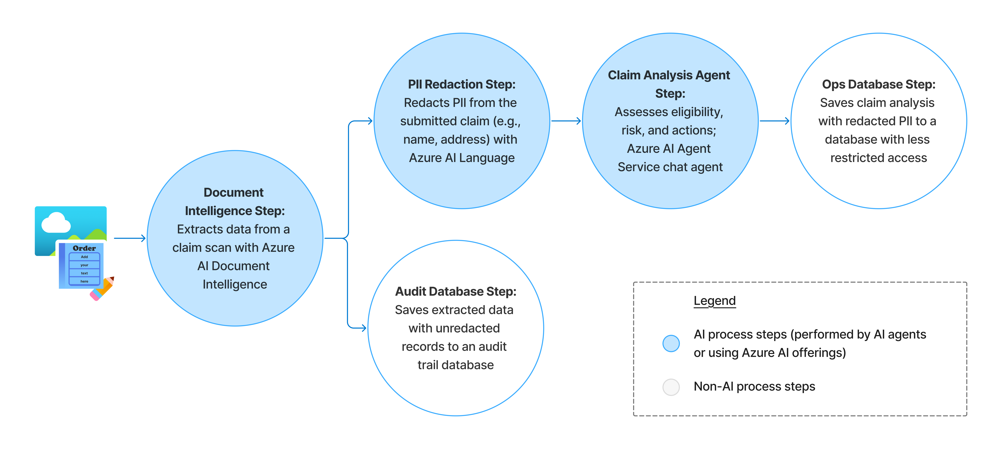

# Semantic Kernel Agent for Warranty Claim Processing Using Azure AI Agent Service

This is a code sample that enables creating a warranty claim processing AI agent implemented with Azure AI Agent Service and Semantic Kernel. The workflow between Azure AI Agent Service agent and tools is orchestrated using the Semantic Kernel Process Framework. This demo showcases the capabilities of Azure in automating complex document-centric workflows.

**IMPORTANT NOTE:** Starter templates, instructions, code samples and resources in this msft-agent-samples file (“samples”) are designed to assist in accelerating development of agents for specific scenarios. It is important that you review all provided resources and carefully test Agent behavior in the context of your use case: ([Learn More](https://learn.microsoft.com/en-us/legal/cognitive-services/agents/transparency-note?context=%2Fazure%2Fai-services%2Fagents%2Fcontext%2Fcontext)). 

Certain Agent offerings may be subject to legal and regulatory requirements, may require licenses, or may not be suitable for all industries, scenarios, or use cases. By using any sample, you are acknowledging that Agents or other output created using that sample are solely your responsibility, and that you will comply with all applicable laws, regulations, and relevant safety standards, terms of service, and codes of conduct.  

## Scenario Overview

Contoso Electronics receives thousands of warranty claims monthly for consumer devices like computers, laptops, speakers, and home sensors. Each claim involves uploaded receipts, claim forms, and incident images—many of which require careful manual review to validate eligibility, redact sensitive information, and assess potential misuse or fraud.

To improve operational efficiency, data privacy, and turnaround time, Contoso has adopted a multi-agent AI system built with Azure AI Agent Service and Semantic Kernel.

This end-to-end solution automates the warranty claim workflow by orchestrating a specialized processusing the Semantic Kernel Process Framework:
* **Document Intelligence step** invokes Azure AI Document Intelligence to scan and extract structured data from submitted claim forms. See a [sample warranty claim](assets/input/sample-claim-signed.png) in the `assets/input` folder.
* **PII Redaction step** uses Azure AI Language Service to redact personally identifiable information (PII), enabling privacy-compliant processing, ensuring that downstream analysis remains bias-free, and minimizing the security risk of leaking sensitive customer data.
* **Claim Assessment Agent step** executes an AI agent, built with Azure AI Agent Service, to verify warranty eligibility, detects anomalies, and analyze claim details. It then recommends next steps (e.g., approve, deny, request more info) and generates a concise summary for reviewers.



With this automated solution, Contoso realizes the following benefits:
* Rapid acceleration of claim processing by delegating laborious tasks to AI
* Improved accuracy by reducing human error and enforcing consistency
* Privacy assurance via redaction and responsible AI practices
* Enterprise extensibility and flexibility, with the ability to add agents to the sequential workflow as new business needs emerge or independently upgrade agents’ implementation with minimal codebase modifications

This use case can be adapted to similar document-heavy scenarios.

## Getting Started

### Prerequisites

* [Python](https://www.python.org/downloads/) 🐍
* [`Azure.Accounts` Powershell module](https://www.powershellgallery.com/packages/Az.Accounts/4.0.2) might be required by the dependencies

### Quickstart

### Step 1: Create Deployment Model

[Follow the official documentation](https://learn.microsoft.com/azure/ai-foundry/quickstarts/get-started-playground#deploy-a-chat-model) to create an Azure AI Foundry model deployment.

#### (Optional) Step 2: Create Azure AI Agent Service Agent

*This step is optional. If you don't create an Azure AI Agent, the program will create one for you automatically.*

1. Follow the official [Azure AI Agent Service documentation](https://learn.microsoft.com/azure/ai-services/agents/quickstart?pivots=ai-foundry-portal) to create the claims analysis agent (a chat completion agent). 
2. In the **Instructions** box, paste the contents of [claims_analysis_agent_instructions.md file](other_assets/claims_analysis_agent_instructions.md).

#### Step 3: Create Azure AI Document Intelligence Resource

1. Follow the official [Azure AI Document Intelligence documentation](https://learn.microsoft.com/azure/ai-services/document-intelligence/how-to-guides/create-document-intelligence-resource) to create your resource.
2. Optionally, test the resource in the AI Foundry portal.

#### Step 4: Configure Application

1. Provide the required secrets in the [src/config/config_secrets.py file](src/config/config_secrets.py). You can retrieve them from your resources or from AI Foundry portal.
1. Setup the configuration variables in the [src/config/config.py file](src/config/config.py). You can retrieve them from your resources or from AI Foundry portal (e.g., in the *Agents* page for your Azure AI Agent Service agent).
    1. Initially, the application defaults to mocked agents. Mock agents don't call the backend AI services; instead they operate on hardcoded data. This allows you to save the cost or reduce the latency when debugging. To remove mocking, set respective (or, all) mocking configuration variables `MOCK_*_STEP` to `False`.

#### Step 5: Install Required Modules

Run the following command to install modules used by the application:

```sh
pip install -r requirements.txt
```

#### Step 6: Run Application

Execute the application:

```sh
python src/template.py
```

## Resources

- Semantic Kernel [documentation](https://learn.microsoft.com/semantic-kernel/overview/) and [GitHub repo with source code](https://github.com/microsoft/semantic-kernel)
- [Azure AI Agent Service documentation](https://learn.microsoft.com/azure/ai-services/agents/)
- [Azure AI Document Intelligence documentation](https://learn.microsoft.com/azure/ai-services/document-intelligence)
- [Azure AI Language documentation](https://learn.microsoft.com/azure/ai-services/language-service/overview)
- [Azure AI Foundry documentation](https://learn.microsoft.com/azure/ai-foundry/)
