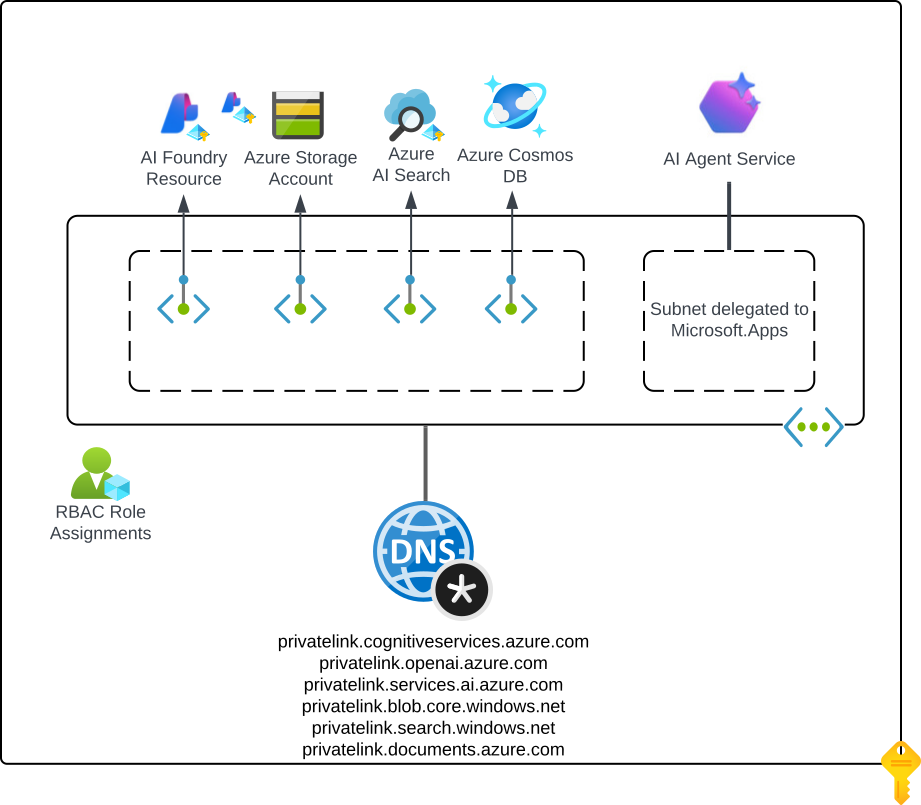

# Updates
**06-27-2025** Initial release

# Azure AI Agent Service: Standard Agent Setup with E2E Network Isolation

> **IMPORTANT**
> 
> Class A subnet support is only available in a limited number of regions and requires your subscription id be allowlisted. Please reach out to fosteramanda@microsoft.com if you are interested in getting access. **Regions with Class A Subnet Support:** westus, eastus us, eastus 2, central us, [NEW] japan east, [NEW] france central
>
> Class B and C subnet support is already GA and available in all regions supported by Azure AI Foundry Agent Service. No subscription allowlisting is required. Deployment templates and setup steps are identical for Class A, B, and C subnets; Class A remains in private preview solely because of its limited region coverage.
 
## Key Information

**Limited Region Support for Class A Subnet IPs**
- Class A subnet support is only available in select regions and requires allowlisting of your subscription ID. Supported regions: westus, eastus us, eastus 2, central us, [NEW] japan east, [NEW] france central

**Region and Resource Placement Requirements**
- **All Foundry workspace resources should be in the same region as the VNet**, including CosmosDB, Storage Account, AI Search, Foundry Account, Project, Managed Identity. The only exception is within the Foundry Account, you may choose to deploy your model to a different region, and any cross-region communication will be handled securely within our network infrastructure.
  - **Note:** Your Virtual Network can be in a different resource group than your Foundry workspace resources
  
This infrastructure-as-code (IaC) solution deploys a network-secured Azure AI agent environment with private networking and role-based access control (RBAC). It supports scenarios where you want a standalone solution for proof-of-concepts. For deployment to existing environments enterprise environments use the [15b-private-network-standard-agent-setup-byovnet deployment](../15b-private-network-standard-agent-setup-byovnet/README.md).

## Prerequisites

1. **Active Azure subscription(s) with appropriate permissions**
  It's recommended to deploy these templates through a deployment pipeline associated to a service principal or managed identity with sufficient permissions over the the workload subscription (such as Owner or Role Based Access Control Administrator and Contributor). If deployed manually, the permissions below should be sufficient.

  - **Workload Subscription**
    - **Role Based Access Control Administrator**: Needed over the resource group to create the relevant role assignments
    - **Network Contributor**: Needed over the resource group to create virtual network and Private Endpoint resources
    - **Azure AI Account Owner**: Needed to create a cognitive services account and project 
    - **Owner or Role Based Access Administrator**: Needed to assign RBAC to the required resources (Cosmos DB, Azure AI Search, Storage) 
    - **Azure AI User**: Needed to create and edit agents

2. **Register Resource Providers**

   Make sure you have an active Azure subscription for the workload that allows registering resource providers. For example, subnet delegation requires the Microsoft.App provider to be registered in your subscription. If it's not already registered, run the commands below:

   ```bash
   az provider register --namespace 'Microsoft.KeyVault'
   az provider register --namespace 'Microsoft.CognitiveServices'
   az provider register --namespace 'Microsoft.Storage'
   az provider register --namespace 'Microsoft.Search'
   az provider register --namespace 'Microsoft.Network'
   az provider register --namespace 'Microsoft.App'
   az provider register --namespace 'Microsoft.ContainerService'
   ```

3. Sufficient quota for all resources in your target Azure region

4. Azure CLI installed and configured on your local workstation or deployment pipeline server

5. Terraform CLI version v1.11.4 or later on your local workstation or depoyment pipeline server. This template requires the usage of both the AzureRm and AzApi Terraform providers.

## Pre-Deployment Steps

Plan an appropriately sized virtual network with sufficient IP space for the subnets below. This address space should not conflict an existing Azure environment or on-premises if you plan to connect this virtual network to those environments.

  - **Agent Subnet** (e.g., 192.168.0.0/24): Hosts Agent client for Agent workloads 
  - **Private endpoint Subnet** (e.g. 192.168.1.0/24): Hosts private endpoints 
    - Ensure that the address spaces for these subnets do not overlap with any existing networks in your Azure environment or connected on-premises environments.

    **Limitations:**
    - Class A subnet support is only available in a limited number of regions and requires your subscription id be allowlisted. Please reach out to fosteramanda@microsoft.com if you are interested in getting access.
      - Regions with class A support: westus, eastus us, eastus 2, and central us

---

## Template Customization

Note: The following resources will be created automatically for you:
- Azure Cosmos DB for NoSQL  
- Azure AI Search
- Azure Storage
- AI Foundry resource
- Virtual network with two subnets
- Private Endpoints for resources above

### Variables

The variables listed below [must be provided](https://developer.hashicorp.com/terraform/language/values/variables#variable-definition-precedence) when performing deploying the templates. The file sample-terraform.tfvars provides a sample Terraform variables file that can be used.

- **location** - The Azure region the resources will be deployed to. This must be the same region where the pre-existing virtual network has been deployed to.

The variables listed below are optional and if not specified will use the defaults as included in the variables.tf file.

- **virtual_network_address_space** - The IP CIDR block that will be associated to the virtual network created by this deployment
- **agent_subnet_address_prefix** - The IP CIDR block carved from the virtual network CIDR that will be associated to the subnet delegated to the agent service.
- **private_endpoint_subnet_address_prefix** - The IP CIDR block carved from the virtual network CIDR that will be associated to the subnet where Private Endpoints will be deployed.

## Deploy the Terraform template

1. Fill in the required information for the variables listed in the sample-terraform.tfvars file and rename the file to terraform.tfvars.

2. Initialize Terraform

```bash
terraform init
```

3. Deploy the resources
```bash
terraform apply
```

## Architecture Overview

The architecture this deployment supports is pictured below with the resources deployed by these templates highlighted in red. You can reference official Microsoft documentation for details on the networking set-up on [Microsoft Learn](https://learn.microsoft.com/en-us/azure/ai-foundry/agents/how-to/virtual-networks).





### Step-by-Step Provisioning Process (main.tf)
1. Create a resource group to store the resources deployed by this template.

2. Create a virtual network with two subnets.

3. Create the Private DNS Zones listed below and link them to the virtual network.
  - privatelink.cognitiveservices.azure.com
  - privatelink.openai.azure.com
  - privatelink.services.ai.azure.com
  - privatelink.blob.core.windows.net
  - privatelink.search.windows.net
  - privatelink.documents.azure.com

4. Create dependent resources for standard setup:
   - Create new Cosmos DB resource
   - Create new Azure Storage resource
   - Create new Azure AI Search resource

5. Create Azure AI Foundry Resource (Cognitive Services/accounts, kind=AIServices)

6. Create account-level connections:
   - Deploy GPT-4o or other agent-compatible model

7. Create private endpoints with DNS resolution for the Azure Resources: Azure Cosmos DB Account, Azure Storage Storage, Azure AI Search, and Azure AI Foundry

8. Create Project (Cognitive Services/accounts/project)

9. Create project connections:
   - Create project connection to Azure Storage account
   - Create project connection to Azure AI Search account
   - Create project connection to Cosmos DB account

10. Assign the project-managed identity (including for SMI) the following roles:
   - Cosmos DB Operator at the scope of the account level for the Cosmos DB account resource
   - Storage Account Contributor at the scope of the account level for the Storage Account resource

11. Set Account capability host with empty properties section.

12. Set Project capability host with properties: Cosmos DB, Azure Storage, AI Search connections

13. Assign the Project Managed Identity (both for SMI and UMI) the following roles on the specified resource scopes:
   - Azure AI Search: Search Index Data Contributor, Search Service Contributor
   - Azure Blob Storage Container: <workspaceId>-azureml-blobstore: Storage Blob Data Contributor
   - Azure Blob Storage Container: <workspaceId>-agents-blobstore: Storage Blob Data Owner
   - Cosmos DB for NoSQL container: <'${projectWorkspaceId}>-thread-message-store: Cosmos DB Built-in Data Contributor
   - Cosmos DB for NoSQL container: <'${projectWorkspaceId}>-system-thread-message-store: Cosmos DB Built-in Data Contributor
   - Cosmos DB for NoSQL container: <'${projectWorkspaceId}>-agent-entity-store: Cosmos DB Built-in Data Contributor

The deployment creates an isolated network environment:

- **Private Endpoints:**
  - AI Foundry
  - AI Search
  - CosmosDB
  - Storage

### Post Deployment

1. Once all resources are provisioned, assign all developers who want to create/edit agents in the project the role: Azure AI User on the project scope.

### Core Components

1. **AI Foundry Resource**
   - Central orchestration point
   - Manages service connections
   - Network-isolated capability hosts
2. **AI Project**
   - Workspace configuration
   - Service integration
   - Agent deployment
3. **Supporting Services for Standard Agent Deployment**
   - Azure AI Search
   - CosmosDB
   - Storage Account
   - Virtual Network with two subnets

---

## Security Features

### Authentication & Authorization

- **Managed Identity**
  - Zero-trust security model
  - No credential storage
  - Platform-managed rotation

- **Role Assignments**
  - **Azure AI Search**
    - Search Index Data Contributor (`8ebe5a00-799e-43f5-93ac-243d3dce84a7`)
    - Search Service Contributor (`7ca78c08-252a-4471-8644-bb5ff32d4ba0`)
  - **Azure Storage Account**
    - Storage Blob Data Owner (`b7e6dc6d-f1e8-4753-8033-0f276bb0955b`)
    - Storage Queue Data Contributor (`974c5e8b-45b9-4653-ba55-5f855dd0fb88`) (if Azure Function tool enabled)
    - Two containers will automatically be provisioned during the create capability host process:
      - Azure Blob Storage Container: `<workspaceId>-azureml-blobstore`
        - Storage Blob Data Contributor
      - Azure Blob Storage Container: `<workspaceId>-agents-blobstore`
        - Storage Blob Data Owner
  - **Key Vault**
    - Key Vault Contributor (`f25e0fa2-a7c8-4377-a976-54943a77a395`)
    - Key Vault Secrets Officer (`b86a8fe4-44ce-4948-aee5-eccb2c155cd7`)
  - **Cosmos DB for NoSQL**
    - Cosmos DB Operator (`230815da-be43-4aae-9cb4-875f7bd000aa`)
    - Cosmos DB Built-in Data Contributor
    - Cosmos DB for NoSQL container: `<${projectWorkspaceId}>-thread-message-store`
    - Cosmos DB for NoSQL container: `<${projectWorkspaceId}>-agent-entity-store`

### Network Security

- Public network access disabled
- Private endpoints for all services
- Service endpoints for Azure services
- Network ACLs with deny by default

---
## Module Structure

```text
code/
├── data.tf                                         # Creates data objects for active subscription being deployed to and deployment security context
├── locals.tf                                       # Creates local variables for project GUID
├── main.tf                                         # Main deployment file        
├── outputs.tf                                      # Placeholder file for future outputs
├── providers.tf                                    # Terraform provider configuration 
├── sample-terraform.tfvars                         # Sample tfvars file
├── variables.tf                                    # Terraform variables
├── versions.tf                                     # Configures minimum Terraform version and versions for providers
```

## Maintenance

### Regular Tasks

1. Review role assignments
2. Monitor network security
3. Check service health
4. Update configurations as needed

### Troubleshooting

1. Verify private endpoint connectivity
2. Check DNS resolution
3. Validate role assignments
4. Review network security groups

---

## References

- [Azure AI Foundry Networking Documentation](https://learn.microsoft.com/en-us/azure/ai-foundry/how-to/configure-private-link?tabs=azure-portal&pivots=fdp-project)
- [Azure AI Foundry RBAC Documentation](https://learn.microsoft.com/en-us/azure/ai-foundry/concepts/rbac-azure-ai-foundry?pivots=fdp-project)
- [Private Endpoint Documentation](https://learn.microsoft.com/en-us/azure/private-link/)
- [RBAC Documentation](https://learn.microsoft.com/en-us/azure/role-based-access-control/)
- [Network Security Best Practices](https://learn.microsoft.com/en-us/azure/security/fundamentals/network-best-practices)
