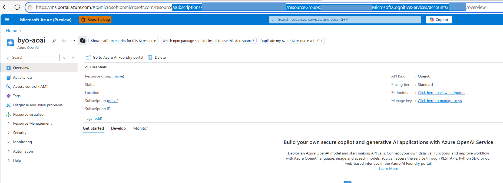

# Azure AI Agent Service: Basic Setup Using an Existing Azure OpenAI Resource

This Bicep template provisions the required resources for a basic agent project. It creates a new Cognitive Services Account and project, and connects your existing Azure OpenAI resource for model deployments.

> **Important:** You must provide the **resource ID** of your existing Azure OpenAI resource when deploying this template.
> **Temporary Limitation:** The Azure OpenAI resource must be in the same region as your Foundry account and project.

All agents created in this project will automatically use Microsoft-managed, multitenant search and storage resources.
---

## Prerequisites

1. **Azure roles**  
   - To deploy the template: **Azure AI Account Owner** or **Contributor**  
   - To create your first agent: **Azure AI User**
2. **Existing Azure OpenAI resource** – you must already have one.  

    Get the resource id in **Azure Portal**
    
---

## Deployment options

Below are two supported approaches.

### 1 — Deploy from the Azure portal (one-click)

[](https://portal.azure.com/#create/Microsoft.Template/uri/https%3A%2F%2Fraw.githubusercontent.com%2Fazure-ai-foundry%2Ffoundry-samples%2Frefs%2Fheads%2Fmain%2Fsamples%2Fmicrosoft%2Finfrastructure-setup%2F42-basic-agent-setup-with-customization%2Fmain.json)

Click the button, then complete the portal wizard.  
Replace **existingAoaiResourceId** with the resource id of your Azure OpenAI resource.

### 2 — Deploy with the Azure CLI

```bash
# sign in and pick the subscription
az login

# create (or reuse) a resource group
az group create --name <rg-name> --location eastus

# deploy
az deployment group create \
  --resource-group <rg-name> \
  --template-file main.bicep \
  --parameters existingAoaiResourceId='/subscriptions/<sub-id>/resourceGroups/<rg-name>/providers/Microsoft.CognitiveServices/accounts/<aoai-name>' \
               account_name='foundry' \
               project_name='myProject'
```
