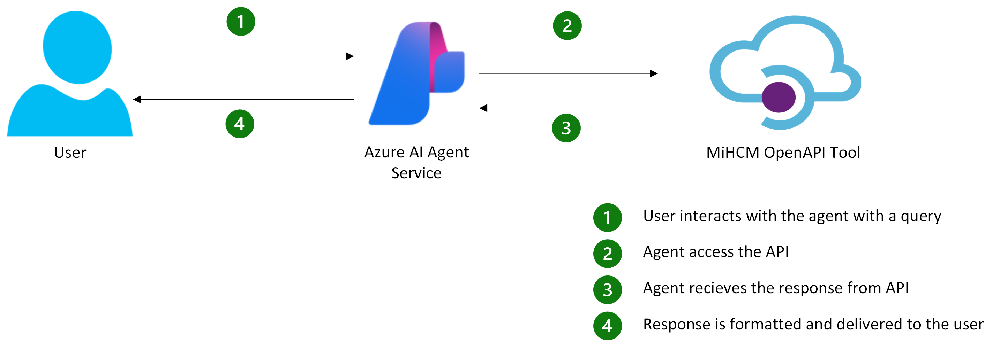

> [!IMPORTANT]
> Important Note From Microsoft:
> * Your use of connected non-Microsoft services is subject to the terms between you and the service provider. By connecting to a non-Microsoft service, you acknowledge that some of your data, such as prompt content, is passed to the non-Microsoft service, and/or your application might receive data from the non-Microsoft service. You are responsible for your use (and any charges associated with your use) of non-Microsoft services and data.
> * The code in this 3p-tools file were created by third parties, not Microsoft, and have not been tested or verified by Microsoft. Your use of the code samples is subject to the terms provided by the relevant third party. By using any third-party sample in this file, you are acknowledging that Microsoft has no responsibility to you or others with respect to these samples.

# MiHCM
<p align="left">
  
</p>

Talk to your HR data and automate workflows with ease.

MiHCM is a global SaaS company that helps organisations embrace the future of work through powerful Digital HR and Work Tech solutions. With a presence in over 20 countries and a growing network of partners across Asia, MiHCM supports 1,000+ companies in industries such as Banking, Finance, Technology, Manufacturing, and Telecommunications. Its Human Capital Management platform simplifies HR processes and enhances workforce engagement across the employee lifecycle. The company’s innovation journey is spearheaded by AI, underscored by its range of AI-powered capabilities, including an Agentic AI Assistant for user support.

The MiHCM OpenAPI tool enables seamless integration with MiHCM's HR functionalities, such as leave management, feedback handling, and work activity tracking. These tools are designed to simplify HR operations and enhance productivity by leveraging MiHCM's robust API ecosystem.

## Features
- **Integration with MiHCM**: Provides tools to interact with MiHCM's HR APIs for tasks like leave management, feedback handling, and work activity tracking.

## Architecture Overview


## Project Structure
- `ArchitectureOverview.png` - High level architecture of the Agent
- `logo.svg` - MiHCM Logo
- `mihcmexternalAPI.json` – OpenAPI specification for MiHCM's external API  
- `README.md` – Project documentation  
- `requirements.txt` – Python dependencies for the project  
- `template_newSDK.py` -  Sample code for the agent 

## Prerequisites

1. **Azure Subscription**: Ensure you have an active Azure subscription.
2. **Python**: Install Python 3.8 or later.
3. **Dependencies**: Install Python dependencies using `pip install -r requirements.txt`.

## Deployment

### Step 1: Configure Environment Variables

Create a `.env` file in the root directory with the following variables:

```properties
PROJECT_ENDPOINT="<Your AI project endpoint>"
PROJECT_OPENAPI_CONNECTION_NAME="<Connection name of your API key>"
```

### Step 2: Define the API Key 
- Navigate to your AI Project and add your API Key as a custom key in the below format:
```
Ocp-Apim-Subscription-Key: <your key>
```
- Update the `PROJECT_OPENAPI_CONNECTION_NAME` with the connection name you created.

### Step 3: Run the python script
- Use the `template_newSDK.py` script to interact with the Azure AI Foundry Agent Service and MiHCM APIs.
- Update the `agent_request` value with different requests for the agent.

## Use Cases 
- What are my leave balances?
- Check my leave balance for 2024. If I have more than 10 days of annual leave, submit an HR request for leave encashment or carry forward.
- Please show me all my HR requests.
- Submit a work activity for 2.5 hours for the meeting with Adventure Works on the Project Kick-off.
- Submit a work activity for yesterday for 2.5 hours for the meeting with Contoso on the Project Kick-off.
- List all my work items for yesterday and today.

## Support
Have a question or need assistance? Get in touch with our team:
- Support: ai-support@mihcm.com
- Info on how to setup an account with MiHCM: https://mihcm.com/contact-us/ 
